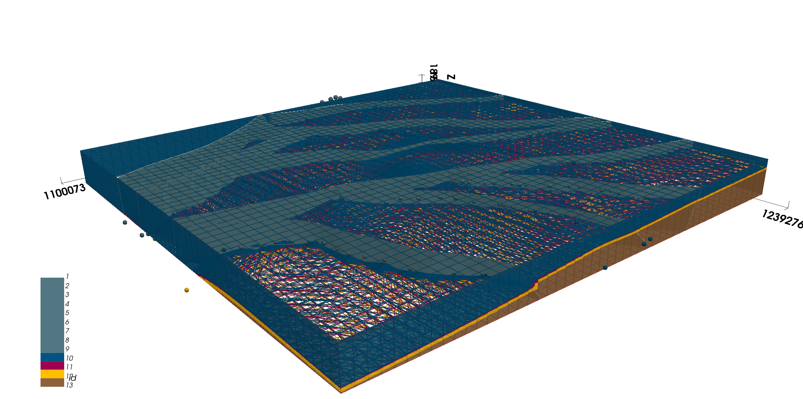
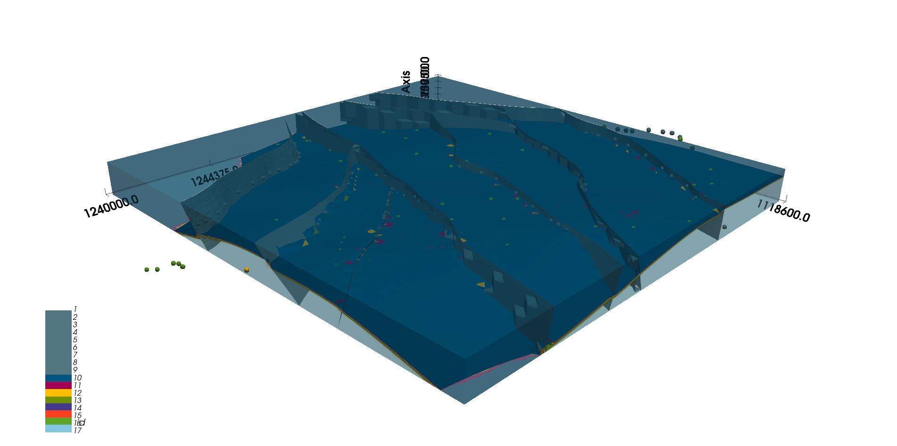

# Geological Modeling of the Los Santos Formation / Modelo Geológico de la Formación Los Santos

[](https://creativecommons.org/licenses/by/4.0/)
[](https://www.gempy.org/)

> 🌐 **[Explore the 3D models interactively](https://andresm669.github.io/los-santos-formation)**

This repository contains the data and results of the 3D geological modeling of the Los Santos Formation, developed as part of the thesis:

> *3D Geological Modeling of the Los Santos Formation to Strengthen the Hydrogeological Model of the Mesa de los Santos (Santander) Using Open-Source Tools*

The modeling was carried out using [GemPy](https://www.gempy.org/) 2.3.1, a free and open-source Python library for implicit 3D geological modeling.

### Repository Structure

### Repository Structure / Estructura del repositorio
```
Data/
├── Regional_data/
│   ├── Orientation_data.txt
│   └── Surface_data.txt
└── Upper_Member_data/
    ├── Orientation_data.txt
    └── Surface_data.txt
Figures/
├── Detailed_model/
│    ├── detailed.png
│── Regional_model/
└──── Regional_model.png
Outputs/
├── Detailed_model.vtkjs
└── Regional_model.vtkjs

LICENSE
README.md
environment.yml
```
### Results

| Regional Model | Detail Model |
|---------------|--------------|
|  |  |

### Interactive 3D Viewer

Explore the models directly in your browser — no installation required:

**[Launch 3D Viewer](https://andresm669.github.io/los-santos-formation)**

Alternatively, the `.vtkjs` files can be downloaded from the `Outputs/` folder and 
opened with the [vtkjs Scene Explorer](https://kitware.github.io/vtk-js/examples/SceneExplorer.html) 
by dragging and dropping the file into the viewer.

### Citation

If you use this data or results, please cite:

> Sánchez-Mateus, A.F. & Duarte-Guevara, E.M. (2025). *Modelado Geológico 3D de la Formación Los Santos Para Fortalecer el Modelo Hidrogeológico de la Mesa de los Santos (Santander) Usando Herramientas de Libre Acceso*. Universidad Industrial de Santander.
> Directores: Velandia-Patiño, F.A. & Cetina-Tarazona, M.A.

---
